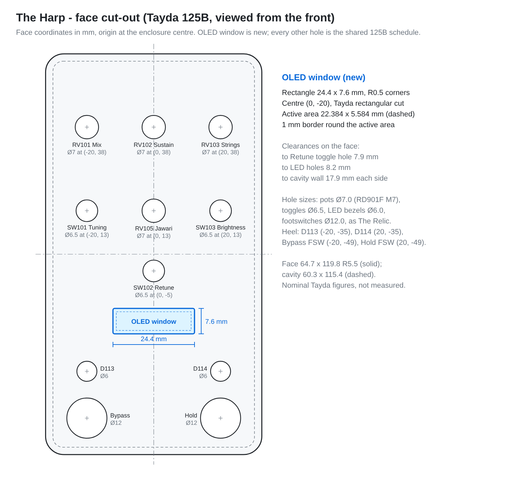
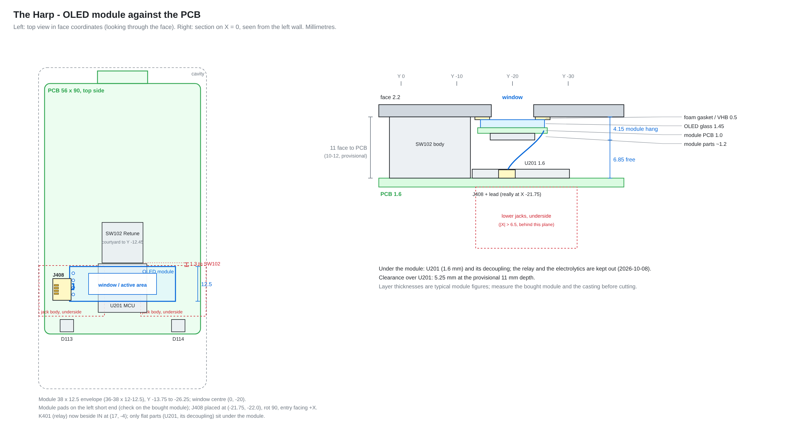

# The Harp — schematic and PCB plan

2026-10-04. Planning only: nothing drawn yet. Companion to
`design-brief.md`. The starting point is The Relic's KiCad project
(`26-A03-0003_The_Relic/kicad/the_relic/`) for the board, the face guides,
the jacks, the pots and the relay bypass, and the Timekeeper's DSP board
(`25-Z01-0001_DSP_Development_Board/kicad/dsp_board/`) for the
MCU, codec, flash and power sheets.

## One board or two

The jacks decide it. The Alchemist and The Relic mount the four 1/4" jacks
and the DC jack on the **underside of the pot board**, so the wall-hole
heights are set by the board depth under the face (about 10–12 mm on the
pot bushings) plus the jack's axis height. To put The Harp's jacks at the
same positions **and heights**, they must sit on a board hanging at that
same depth, and that is the board the pots are on. So:

- **Plan A, one board (default).** The Alchemist/Relic 56 × 90 mm outline
  with the DC tab, four layers, pots, toggles, LEDs, jacks, relay, analog
  and the whole digital section on it. This is what the rest of this
  document plans.
- **Plan B, fallback.** If the parts do not fit, keep a *face board* with
  everything that touches the enclosure (pots, toggles, LEDs, jacks, DC,
  relay, input and output buffers) and move the H750, flash, codec and
  power onto a *DSP board* below it, joined by a 24-way 1.0 mm FFC as the
  Timekeeper's two boards are. The face board stays exactly the Relic's
  outline, so jacks and pots do not move. This costs a second PCB, two FFC
  connectors and the cable (about 3 EUR at 100 after the Relic's figures),
  and about 8 mm more depth, which the 125B has.

### Does Plan A fit? Estimate

| Section | Parts (approx.) | Source |
|---|---|---|
| H750VBT6, decoupling, crystal, NRST, BOOT0, SWD pads | 25 | Timekeeper U201 group, fewer VDD pins |
| W25Q128 QSPI flash | 3 | Timekeeper U901 |
| Power: TVS, series Schottky, buck TPS54202 (3.3 V), LDO NCP718 (5 VA), filters | 22 | Timekeeper U301/U302 |
| AK4621EF codec, reference buffer OPA2348, 2 × THS4522 DFA, passives | 55 | Timekeeper IC401, U401, U501, U601 |
| Input buffer OPA2365 + anti-alias, expression buffer MCP6001, ESD | 20 | Timekeeper U801, U702 |
| Output buffers OPA1688 L/R + reconstruction, ESD | 18 | Timekeeper U802 |
| Relay bypass: G6K-2F-Y, 2N7002 ×2, diode, resistors, RC on the footswitch inputs | 12 | Relic K401 group, Alchemist relay |
| 4 pots, 3 toggles, 2 LEDs, OLED connector and pull-ups | 22 | Alchemist + new |
| 5 jacks, 2 footswitch pad pairs | 7 | Alchemist |
| **Total** | **≈ 191** | |

The Relic places 120 parts on this outline with room to spare in the
digital zone; the Timekeeper's DSP board carries 145 (with SDRAM and a
144-pin MCU) on a larger board. About 190 parts, most of them 0402/0603
and the LQFP-100 at 14 × 14 mm, on 56 × 90 mm minus the DC tab is **tight
but expected to fit**, because SMD parts may sit over the jack bodies
(Relic rule) and the four-layer stack keeps the routing off the top. The
go/no-go is the placement step below; if the codec and MCU groups cannot
be zoned apart from the input buffer with the LEDs in place, go to Plan B
rather than squeeze.

## Enclosure and datum

Taken unchanged from The Relic (`docs/main-board-placement.md`):

- Tayda 125B, face 64.7 × 119.8, cavity 60.3 × 115.4, corner bosses
  avoided. Nominal until a casting is measured.
- Datum: enclosure centre = PCB (148.5, 105), face X right, face Y up;
  drill/place origin and grid origin there.
- Board: 56 × 90 mm, R2, face X ±28, Y +52 to −38, 18 mm tab to +56.5 under
  the DC jack. Top side components only, except the jacks; through-hole
  parts only where no jack body is underneath; SMD over the jack bodies is
  allowed.

## Face schedule

One face standard for The Alchemist, The Relic and The Harp: every
position below is a shared Tayda drill coordinate, and each pedal uses
the subset it needs.

| Position (face X, Y) | Alchemist | Relic | Harp |
|---|---|---|---|
| Knob row +38: (−20), (0), (+20) | Rate, Depth, Wave | Wow, Flutter, Age | RV101 Mix, RV102 Sustain, RV103 Strings |
| Knob row +13: (−20), (0), (+20) | Mode toggle, Exp/offset pot, Resonance toggle | Saturation, Mix, Hiss | SW101 Tuning toggle, RV105 Jawari, SW103 Brightness toggle |
| Toggle row −5: (−20), (0), (+20) | — | Dropout, Age range, Hiss on | centre only: SW102 Retune toggle |
| Right wall, lower jack, axis Y −22.5 | IN | IN | J402 IN |
| Right wall, upper jack, axis Y −3.5 | Expression | — | J406 EXP |
| Left wall, lower jack, axis Y −22.5 | OUT | OUT | J403 OUT L |
| Left wall, upper jack, axis Y −3.5 | Sync | — | J404 OUT R |
| Top wall DC, X 0 | DC | DC | J401 DC |
| LEDs (−20, −35), (+20, −35) | Effect, Rate | Effect, — | D113 Effect, D114 Hold |
| Footswitches (−20, −49), (+20, −49) | Bypass, Tap | Bypass, — | Bypass (J405), Hold (J407) |
| OLED window (0, −20) | — | — | 24.4 × 7.6 mm rectangular cut for the 0.91 in OLED; module on J408 (see *OLED mounting*) |

**Controls over the upper jacks (resolved 2026-10-06).** The upper jack
bodies sit on the underside at face X ±6.5 to ±30, Y +5.6 to −12.6, with
their rear pin row at Y +4.6. The first face (The Relic's six knobs and
three toggles) did not fit them: the outer lower-row pots RV104/RV106 had
their pins at Y +5.5, on the jacks' rear pads, and the outer toggles at
(±20, −5) put their pins over the jack bodies. The Harp now follows The
Alchemist (design brief, decision 13): the outer positions of the +13 row
carry the Tuning and Brightness toggles, whose pins start at Y +8.3, 1.3 mm
clear of the bodies; Jawari is the only knob in that row, at X 0 where
there is no jack body; the Retune toggle at (0, −5) uses the Taiway
footprint, pins within X ±2.4, about 2.7 mm clear. No through-hole pad sits
over a jack. All three toggles are Taiway 100-DP6-T200B1M2QE ON-ON-ON on The
Alchemist's `100DP3T1B2M2QE` footprint (shaft at origin + (−2.415, +4.7)).

## OLED mounting (2026-10-08)





Drawings generated by `scripts/oled_drawings/oled_drawings.py` from the
figures below and the footprint courtyards in `The Harp.kicad_pcb`.

- **Module.** A 0.91 in 128 × 32 SSD1306 I²C module, 4 pads (GND, VCC,
  SCL, SDA) on one short end, run from +3V3. Envelope 36–38 × 12–12.5 mm
  (Waveshare 36 × 12.5; generic boards up to 38 × 12); glass 30 × 11.5 ×
  1.45 mm; active area 22.384 × 5.584 mm. The SSD1306 and its charge pump
  are on the module, so the PCB carries only J408, the pull-ups and C104.
- **Window.** 24.4 × 7.6 mm, R0.5, centred at face (0, −20), a Tayda
  rectangular cut: the active area plus a 1 mm border. 7.9 mm clear of the
  Retune toggle hole, 8.2 mm clear of the LED holes, 17.9 mm from the
  cavity wall each side.
- **Why Y −20, not −18.** The Retune toggle's courtyard (SW102) reaches
  face Y −12.45. A 12.5 mm module centred at −18 would reach −11.75 and sit
  on it; centred at −20 it spans −13.75 to −26.25, 1.3 mm clear.
- **Fixing.** The module hangs from the face, not from the PCB. A small
  3D-printed carrier (a pocket for the module with a lip round the glass,
  as the Timekeeper's TFT frame) is bonded to the inside of the face with
  VHB tape and registered on the window edges; a 0.5 mm foam gasket
  between the glass and the face keeps dust out. Fallback: VHB foam on the
  glass rim straight onto the face. It is not screwed to the PCB because
  the lower jack bodies sit under the board at |X| > 6.5 (screws from below
  would hit them) and the MCU fills the middle; hanging it from the face
  also keeps the board-depth tolerance out of the glass position.
- **Wiring.** The module's pin header is left off. Four wires (28–30 AWG,
  about 40 mm with slack) run from its pads to J408, a JST SH 4-way
  (SM04B-SRSS-TB) on the top side, placed on 2026-10-08 at PCB (125.0,
  122.5), rotation 90°, face (−23.5, −17.5): pads in a column at face
  X −25.5, cable entry facing +X towards the module's pad end. Courtyard
  X −26.78 to −20.22, Y −13.6 to −21.4: 1.22 mm from the board edge and
  0.62 mm clear of J405. It sits over the left lower jack body, where SMD
  parts are allowed. Mounting pads (MP) have no net. Pin 1 GND, 2 +3V3, 3 SCL,
  4 SDA. The PCB lifts out with the face, so the lead never has to be
  unplugged to open the box.
- **Heights.** Face 2.2 mm; below it the gasket 0.5, glass 1.45, module PCB
  1.0 and its parts about 1.2: the module hangs 4.15 mm, leaving 6.85 mm to
  the PCB at the provisional 11 mm face-to-PCB depth (10–12 mm).
- **Relay K401 moved clear of the module (2026-10-08).** Seeded from The
  Relic at PCB (143.4, 134.85), its courtyard (Y −24.6 to −35.1, 5.2 mm
  tall) overlapped the module in plan from −24.6 to −26.25 with only
  1.65 mm vertical clearance (0.65 mm at a 10 mm depth). It is now at PCB
  (143.9, 137.0), face (−4.6, −32.0): 2.15 mm towards the heel and 0.5 mm
  right, courtyard X −9.25 to +0.05, Y −26.75 to −37.25. That is 0.5 mm
  clear of the module edge in plan, 0.12 mm clear of Q402's courtyard and
  0.75 mm from the board edge at −38 (a straight 2.5 mm move would have
  overlapped Q402 and come within 0.4 mm of the edge). Not yet routed.
  Keep everything else under the module below about 6.8 mm.
- **Still to check.** Measure the bought module (pad end, glass position
  on its board, thickness) and the casting depth, then confirm the window
  centre lies on the active area and the carrier height.

## Zoning (top side, face coordinates)

```
 Y +52 ─────────────────────────────────────────  DC tab: TVS, Schottky, buck (U301) and its inductor
       │ RV101        RV102        RV103        │  row +38; buck output filter between the pots
       │   LDO 5VA, +3V3 distribution           │
       │ SW101        RV105        SW103        │  row +13; 3.3 V analog filter, pot RC filters
       │ codec IC501 + U501, ADC driver U601    │  under the pot rows: codec, DFAs, OPA2348
       │              SW102                     │  row −5
       │ ─── OLED window (0, −20), module ───── │  hangs from the face; J408 at (−23.5, −17.5)
       │ OUT U702  │   H750 U201     │ IN U701  │  band −18…−38: output side left, input side right
       │ relay K401│   flash U202    │ EXP U401 │
       │ D113 (−35)  J405  W201 SWD  J407  D114 │
 Y −38 ─────────────────────────────────────────
```

Signal runs right to left as on the Alchemist: IN and EXP enter on the
**right** wall, OUT L/R leave on the **left**. So the input and expression
buffers sit at the right-hand end of the lower band next to J402/J406, the
output buffers and the relay at the left-hand end next to J403/J404, and
the H750 with the flash in the middle. The relay takes the Relic's K401
position (the Alchemist's old FFC spot).

Rules carried over from The Relic:

- Four layers, F.Cu signals and parts / In1.Cu solid GND, never cut /
  In2.Cu power (+9V, +3V3, +3V3A, +5VA) / B.Cu longer signals and the jacks.
- Every SMD GND pad gets its own via to In1.Cu; through-hole parts use their
  barrels. No via under the SWD needle pads.
- Analog and digital separated by placement, not by a split plane: the
  codec's analog side, the input buffer and the output buffers face the
  jacks; the MCU, flash and buck are kept to the centre and the DC end.
  Digital tracks (QSPI, SAI, SWD) stay inside the MCU zone.
- The buck converter and its inductor live on the DC tab, as far from the
  input buffer as the board allows; its switching node is kept off B.Cu over
  the jack bodies.

## Schematic sheets (drawn 2026-10-04)

Root sheet plus seven, generated by `scripts/harp_schematic/build_layout.py` from
`harp_spec.py` (see that folder's README). Circuits are the Timekeeper's
(`25-Z01-0001`, `kicad/dsp_board`) unless noted; the bypass is The
Relic's.

| # | Sheet | Designators | Contents |
|---|---|---|---|
| 1 | Controls and LEDs | RV101–103, RV105, R101–103, R105, R107–108, C101–105, SW101–103, J408 | Pots across +3V3, wipers through 1k / 100n to PA0, PA1, PA2, PA4; ON-ON-ON toggles, commons to GND, pins 3 and 4 to PE11–PE15 and PB10; J408 for the 0.91 in OLED on PB6 / PB7 (I²C1) with 4.7k pull-ups |
| 2 | MCU | U201, U202, C201–214, R201–204, FB201, Y201, W201 | STM32H750VBT6, five 100n + 4.7u, 2 × 2.2u VCAP, VDDA/VREF+ through 220R ferrite, 25 MHz HSE, NRST 100n, BOOT0 10k, Segger needle SWD with 22R, W25Q128 on QUADSPI bank 2 |
| 3 | Power | J401, D301–302, FB301–303, U301–302, L301, C301–312, R301–303 | Timekeeper power: SMAJ10CA, PMEG3010 series, TPS54202 → +3V3, NCP718 → +5V; +9V feeds relay and LEDs |
| 4 | Jacks and Bypass | J402–407, K401, Q401–403, D113–114, D402–407, R404–418, C408–412, U401 | Four NMJ6HCD2 jacks (IN is TRS: tip left, ring right), ESD on each, relay bypass on OUT L (Omron G6K-2F-Y), effect and Hold LED drivers, two footswitch pad pairs with RC, Timekeeper expression buffer (MCP6001) |
| 5 | Codec | IC501, U501, R501, R504–505, C501–509 | AK4621EF, OPA2348 VCOM buffers (VCOM_A, VCOM_B), PDN RC, AINL and AINR from the two ADC driver channels |
| 6 | ADC Driver | U601, R601–612, C601–618 | THS4522 channels A (left) and B (right), single-ended to differential, gain 0.59 (R603/R604 and R609/R610 620 Ω) |
| 7 | Analog In and Out | U701–702, R701–719, C701–707 | OPA2365 input buffer, OPA1688 difference amplifiers L and R, 10u, 100R, 1M |

190 parts. Each sheet is wired directly from a hand layout
(`scripts/harp_schematic/layouts/`) to the Frogmouth schematic standard:
global labels only for nets that leave the sheet, a power symbol at each
rail and ground point, and the generator re-reads its own output and traces
every net pin by pin against the spec (no shorts, every pin on its net).

Differences from the Timekeeper, all deliberate:

- **Stereo in.** The IN jack is TRS, tip left and ring right. Both channels
  have an input buffer (the two OPA2365 halves) and a THS4522 channel into
  the codec's AINL and AINR; nothing on the codec inputs is parked. The
  AK4621EF has no single-ended mode (differential inputs only), so the
  THS4522 does the single-ended to differential conversion for both
  channels, as on the Timekeeper. The relay isolates the left input only;
  the right is muted in firmware in true bypass. A mono plug grounds the
  ring: the right channel reads silence and the firmware copies left to
  right.
- **ADC driver reference.** The Timekeeper left the driver's IN_N open; here
  it goes to VCOM_A, the DC level of the input buffer output. This is the
  fix the Timekeeper's own input noise review recommends (finding H1).
  The THS4522 itself stays: it is made for the single 5 V analog rail
  (rail-to-rail output, VOCM pins the output common mode to the codec's
  VCOM). Replacing it with the spare OPA1656 half was tried and reverted
  on 2026-10-05.
- **Input op-amp: OPA2365, not OPA1656.** The OPA1656's input range is
  (V−) to (V+) − 2.25 V (datasheet SBOS901C, 6.6), so on the 5 V rail it
  stops at 2.75 V, only 0.25 V above the 2.5 V bias. The Timekeeper's own
  bench numbers (input noise review, H2 table: peaks at −16 dBFS with a gain
  of 0.152) put hard-played peaks at about ±1.5 V at the buffer, so its
  positive peaks run more than 1 V past that limit. The OPA2365 is a
  zero-crossover rail-to-rail-input part for 2.2–5.5 V, pin-compatible, so
  the 2.5 V bias, the THS4522 and the 5 V rail stay as they are. A 9 V
  buffer supply was ruled out; the OPA2156 (two input stages) was rejected
  because every positive peak would cross its handover step.
- **H2 fix from the Timekeeper's input noise review.** R705 (the
  Timekeeper's R810) is 49.9 Ω, not 5.1 kΩ, and R602 is 1.05 kΩ to match
  the signal leg, so the legs are balanced and the gain is no longer cut to
  about 0.16.
- **Gain 0.59, not 1: R603/R604 are 620 Ω.** At unity a hard-played
  humbucker already reaches ADC full scale and a synth or line source clips.
  At 620 Ω a 4.8 Vpp input, the most the OPA2365 can swing on 5 V, just
  reaches full scale: a normally played single coil lands near −18 dBFS, a
  hard humbucker near −4 dBFS, a +4 dBu synth near −3 dBFS. Decided
  2026-10-05 for both the Harp and the Timekeeper.
- **No input pad.** Sources above 4.8 Vpp (about +7 dBu) clip at the
  OPA2365 and are turned down at the source; no switchable pad in the audio
  path (design brief, decision 11).
- **Outputs not crossed.** The Timekeeper wired AOUTR to its left output; here
  AOUTL is OUT L. Swap the channels in firmware when porting.
- **Output pull-downs.** 100R series and 1M to GND after each 10u, the Relic
  convention, so the outputs sit at 0 V when the DSP is muted.
- **QUADSPI on bank 2** (next section).

## MCU pin map (LQFP-100)

| Function | Pins | Note |
|---|---|---|
| SAI1 to codec | PE2 MCLK_A, PE4 FS_A, PE5 SCK_A, PE6 SD_A (to SDTI), PE3 SD_B (from SDTO) | Same as the Timekeeper |
| Codec control | PC14 CCLK, PC15 CDTI, PB8 CSN, PB4 PDN | Same as the Timekeeper, bit-banged |
| QUADSPI bank 2 | PB2 CLK, PC11 BK2_NCS, PE7–PE10 BK2_IO0–3 | PF6–PF10 do not exist on LQFP-100, and bank 1 IO2 is only on PE2 (taken by SAI1 MCLK). Single flash on bank 2: FSEL = 1 in the QSPI init. **[CONFIRM AF9/AF10 in CubeMX]** |
| Pots | PA0 Mix, PA1 Sustain, PA2 Strings, PA4 Jawari (ADC1) | The Timekeeper's DMA scan; PA3 and PA5 free |
| Expression | PB1 (ADC1) | Same as the Timekeeper |
| Toggles | PE11/PE12 Tuning, PE13/PE14 Retune, PE15/PB10 Brightness | Two inputs each, internal pull-ups; up = A low B high, centre = both low, down = A high B low |
| Footswitches | PB12 bypass, PB13 hold | Internal pull-ups, 1k / 100n RC |
| Relay | PC10 | Same as the Timekeeper |
| LEDs | PC6 effect, PC7 hold (TIM3 CH1/CH2 PWM) | Through 2N7002 from +9V |
| OLED | PB6 SCL, PB7 SDA (I2C1) | 4.7k pull-ups to +3V3, J408 module connector |
| SWD | PA13, PA14, PB3 SWO, NRST | Segger 8.06.05 needle adapter |
| HSE | PH0, PH1 | 25 MHz, 8 pF |
| Free | PA6–PA12, PA15, PB0, PB5, PB9–PB11, PB14–PB15, PC0–PC5, PC8–PC9, PC12–PC13, PD0–PD15, PE0–PE1, PE11, PE15 | No-connect flags on the schematic |

## Order of work

1. **Firmware first on the Timekeeper board**: string bank, chord tracker,
   tuning manager, with the Timekeeper's pots/expression as stand-ins. This
   proves the sound before any Harp PCB is drawn and gives the CPU number.
2. ~~Create the repo and seed the KiCad project from The Relic.~~ Done
   2026-10-04.
3. ~~Draw the schematic.~~ First draft generated 2026-10-04 (sheets above).
   Open it in KiCad and run ERC.
4. Confirm the [CONFIRM]
   items: the OPA2365 1 kHz noise figure on its data sheet plot (estimated
   about 11 nV/√Hz; capacitive-load stability is checked, see below), QUADSPI bank 2 AFs, AK4621 unused-input handling, THS4522
   unused-channel handling.
5. ERC, then *Update PCB from Schematic* (the board was already synced by
   script on 2026-10-08: 190 footprints, J408 placed, K401 moved for the
   OLED, see *OLED mounting*); place MCU/flash in the centre band,
   codec under the pots, buffers at the jack ends, buck on the tab. **Go/no-go
   for Plan A here.**
6. GND vias per the Relic rule, route (F.Cu short, B.Cu long, In2 power),
   DRC with the Relic's `.kicad_dru`.
7. Export BOM with the adapted exporter; cost at 100; drill schedule for
   Tayda from the face table above (same tool as the Relic).
8. Fix the wall-hole heights from the measured Alchemist/Relic assembly.

## OPA2365 checks and simulation (2026-10-05)

The Harp's input stage is the Timekeeper's, mono, with the same values (U701 = U801,
R705 = R810, R601/R602 = R501/R502, C702 = C807), so the Timekeeper's input-chain
simulation covers it: `25-Z01-0001_DSP_Development_Board/simulations/InputChain`
(TheFrogMouth/25-Z01-0001_DSP_Development_Board#199).

- **Stability into about 320 pF through 49.9 Ω:** the OPA2365 data sheet gives unity-gain
  stability to about 1 nF and recommends 10–20 Ω isolation; simulated overshoot at the THS4522
  input is ≤ 0.5 % for open-loop output resistance 10–100 Ω (42–76 % without the resistor).
- **Noise:** about 11 nV/√Hz at 1 kHz estimated from the data sheet's 100 kHz and 0.1–10 Hz
  figures; it adds about 0.9 dB over the pickup and bias-resistor noise at the ADC.
- **Gain and headroom:** jack to ADC 0.59 with R603/R604 at 620 Ω (0.95 at 1 kΩ). Guitar and
  synth sources up to 4.8 Vpp reach the ADC without clipping; see the simulation's level table,
  gain against R503/R504, and the guitar and synth headroom graphs.

## Timekeeper rework from the same findings

The Timekeeper (25-Z01-0001) carries all three input-stage issues; fixes for
built boards and the next revision:

| Issue | Timekeeper parts | Fix |
|---|---|---|
| OPA1656 input range on 5 V | U801 | Swap for OPA2365AIDR (same SOIC-8 pinout, both halves used, L and R) |
| H2, series resistor | R809, R810 | 5.1 kΩ → 49.9 Ω |
| H2, leg matching | R502 in both AnalogInputBuffer instances | 1 kΩ → 1.05 kΩ |
| H1, floating IN_N | IN_N of InputBufferA and InputBufferB (CODEC sheet) | Connect to VCOM_A: a wire on built boards, a schematic fix next revision |

All four are applied to the Timekeeper schematic, PCB values and BOM in TheFrogMouth/25-Z01-0001_DSP_Development_Board#199 (the H1 connection still needs routing).
